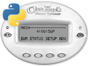

# pyMATE



pyMATE is a python library that can be used to emulate an Outback MATE unit, and talk to any supported
Outback Power Inc. device such as an MX charge controller, an FX inverter, a FlexNET DC monitor, or a hub with
multiple devices attached to it.

You will need a simple adapter circuit and a TTL serial port. For more details, see [jared.geek.nz/pymate](http://jared.geek.nz/pymate)

To see the library in action, check out my post on connecting it with Grafana! [jared.geek.nz/grafana-outback-solar](http://jared.geek.nz/grafana-outback-solar)

Also, check out my Arduino companion project [uMATE](https://github.com/jorticus/uMATE)

## MX/CC Charge Controller Interface

To set up communication with an MX charge controller:
    
```python
mate_bus = MateNET('COM1')         # Windows
mate_bus = MateNET('/dev/ttyUSB0') # Linux

mate_mx = MateMXDevice(mate_bus, port=0) # 0: No hub. 1-9: Hub port
mate_mx.scan()  # This will raise an exception if the device isn't found
```

Or to automatically a hub for an attached MX:
```python
bus = MateNET('COM1', supports_spacemark=False)
mate = MateMXDevice(bus, port=bus.find_device(MateNET.DEVICE_MX))

# Check that an MX unit is attached and is responding
mate.scan()
```

You can now communicate with the MX as though you are a MATE device.

### Status

You can query a status with `mate_mx.get_status()`. This will return an [MXStatusPacket](matenet/mx.py#L14) with the following information:

```python
status = mate_mx.get_status()
status.amp_hours       # 0 - 255 Ah
status.kilowatt_hours  # 0.0 - 6553.5 kWh
status.pv_current      # 0 - 255 A
status.bat_current     # 0 - 255 A
status.pv_voltage      # 0.0 - 6553.5 V
status.bat_voltage     # 0.0 - 6553.5 V
status.status          # A status code. See MXStatusPacket.STATUS_* constants.
status.errors          # A 8 bit bit-field (documented in Outback's PDF)
```

All values are floating-point numbers with units attached. You can convert them to real floats with eg. `float(status.pv_voltage) # 123.4`, or display them as a human-friendly string with `str(status.pv_voltage) # '123.4 V'`
    
### Log Pages
    
You can also query a log page (just like you can on the MATE), up to 127 days in the past: (Logpages are stored at midnight, 0 is the current day so far)

```python
logpage = mate_mx.get_logpage(-1)  # Yesterday's logpage
logpage.bat_max         # 0.0 - 102.3 V
logpage.bat_min         # 0.0 - 102.3 V
logpage.kilowatt_hours  # 0.0 - 409.5 kWh
logpage.amp_hours       # 0 - 16383 Ah
logpage.volts_peak      # 0 - 255 Vpk
logpage.amps_peak       # 0.0 - 102.3 Apk
logpage.absorb_time     # 4095 min  (minutes)
logpage.float_time      # 4095 min
logpage.kilowatts_peak  # 0.000 - 2.047 kWpk
logpage.day             # 0 .. -127
```
    
### Properties
    
Additionally, you can query individual registers (just like you can on the MATE - though it's buried quite deep in the menus somewhere)

```python
mate_mx.charger_watts
mate_mx.charger_kwh
mate_mx.charger_amps_dc
mate_mx.bat_voltage
mate_mx.panel_voltage
mate_mx.status
mate_mx.aux_relay_mode
mate_mx.max_battery
mate_mx.voc
mate_mx.max_voc
mate_mx.total_kwh_dc
mate_mx.total_kah
mate_mx.max_wattage
mate_mx.setpt_absorb
mate_mx.setpt_float
```
    
Note that to read each of these properties a separate message must be sent, so it will be slower than getting values from a status packet.

## FX Inverter Interface

To set up communication with an FX inverter:

```python
mate_bus = MateNET('COM1')         # Windows
mate_bus = MateNET('/dev/ttyUSB0') # Linux

mate_fx = MateDCDevice(bus, port=bus.find_device(MateNET.DEVICE_FX))
mate_fx.scan()

status = mate_fx.get_status()
errors = mate_fx.errors
warnings = mate_fx.warnings
```

### Controls

You can control an FX unit like you can through the MATE unit:

```python
mate_fx.inverter_control = 0  # 0: Off, 1: Search, 2: On
mate_fx.acin_control = 0      # 0: Drop, 1: Use
mate_fx.charge_control = 0    # 0: Off, 1: Auto, 2: On
mate_fx.aux_control = 0       # 0: Off, 1: Auto, 2: On
mate_fx.eq_control = 0        # 0: Off, 1: Auto, 2: On
```
    
These are implemented as python properties, so you can read and write them. Writing to them affects the FX unit.

**WARNING**: Setting inverter_control to 0 **WILL** cut power to your house!
    
### Properties

There are a bunch of interesting properties, many of which are not available from the status packet:

```python
mate_fx.disconn_status
mate_fx.sell_status
mate_fx.temp_battery
mate_fx.temp_air
mate_fx.temp_fets
mate_fx.temp_capacitor
mate_fx.output_voltage
mate_fx.input_voltage
mate_fx.inverter_current
mate_fx.charger_current
mate_fx.input_current
mate_fx.sell_current
mate_fx.battery_actual
mate_fx.battery_temp_compensated
mate_fx.absorb_setpoint
mate_fx.absorb_time_remaining
mate_fx.float_setpoint
mate_fx.float_time_remaining
mate_fx.refloat_setpoint
mate_fx.equalize_setpoint
mate_fx.equalize_time_remaining
```

## FLEXnet DC Power Monitor Interface

To set up communication with a FLEXnet DC power monitor:

```python
mate_bus = MateNET('COM1')         # Windows
mate_bus = MateNET('/dev/ttyUSB0') # Linux

mate_dc = MateDCDevice(bus, port=bus.find_device(MateNET.DEVICE_FLEXNETDC))

mate_dc.scan()

status = mate_dc.get_status()
```

The following information is available through `get_status()`:
- State of Charge (%)
- Battery Voltage (0-80V, 0.1V resolution)
- Current kW/Amps for Shunts A/B/C
- Current kW/Amps for In/Out/Battery (Max +/-1000A, 10W/0.1A resolution)
- Daily kWH/Ah for Shunts A/B/C & In/Out/Battery/Net
- Daily minimum State of Charge
- Days since last full charge (0.1 day resolution)

You can manually reset daily accumulated values by writing to certain registers, 
but this is not yet implemented.

## Example Server

For convenience, a simple server is included that captures data periodically
and uploads it to a remote server via a REST API.
The remote server then stores the received data into a database of your choice.


## PJON Bridge

The default serial interface doesn't always work well, and it's not the most efficient,
so there is an alternative protocol you can use which pipes the data to an Arduino via PJON protocol.

To use this alternative protocol:

```python
port = MateNETPJON('COM1')
bus = MateNET(port)
```

See [this page](https://github.com/jorticus/uMATE/blob/master/examples/Bridge/Bridge.ino) in my uMATE project for an example bridge implementation.

## MATE Protocol RE ###

For details on the low-level communication protocol and available registers, see [doc/protocol/Protocol.md](doc/protocol/Protocol.md)

---

I am open to contributions, especially if you can test it with any devices I don't have.
