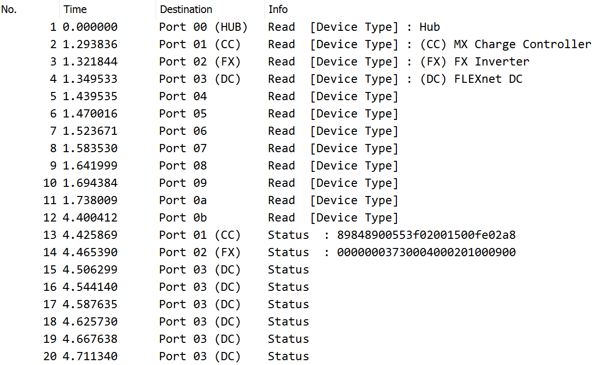

# MATE Protocol

he MATE protocol is implemented using 24V logic, where HIGH is >50% of Vsupply, and LOW is <50%.
Data is big-endian (most significant byte first) NOTE: Arduino/AVR is little-endian.
Serial format is 9n1, 9600 baud

The 9th bit is used to denote the start of the packet.
The MATE is the master and will always drive the communication (the device cannot send any asynchronous responses or commands). Commands and response packets have different formats, and the length of the packet depends on what type of packet it is. There isn't an easy way to determine the length of a packet without knowing something about the protocol.

For MATE->Device commands, the first byte is the destination port (if there is a hub), or 00 if there is no hub.
For Device->MATE responses, the first byte matches the command ID that it is responding to.

```
        Port (00: No Hub)
        |  Command (02: Read)
        |  | Register (00: Device Type)
        |  | |     Value (Unused)
        |  | |     |     Checksum
        |  | |………| |………| |………|
  TX: 100 02 00 00 00 00 00 03   (Command)
  RX: 102 00 04 00 06            (Response)
        | |………| |………|
        | |     Checksum
        | Value (04: FLEXnet DC)
        Command (02: Read)
```

The above packet is reading register 0000h which always returns the type of device connected.

The checksum is a simple sum of all bytes, excluding the 9th bit.

Command Types:

```
00: Increment/Disable
01: Decrement/Enable
02: Read
03: Write
04: Retrieve Status Page
22: Retrieve Log Page (MX Only)
```

Device Types:

```
01: Hub
02: FX
03: MX
04: DC
```

## Register Map ##

Most settings & values are accessible through 16-bit registers.
You can use commands 00 through 03 on registers. All registers can be read with the READ command (`0x02`), which will return the 16 bit value.

Some registers allow you to directly modify them with a WRITE command (`0x03`). The written value will be returned in the response (if successful).

Some registers will allow you to control things (eg. AUX relay, turn Inverter on/off) by sending a WRITE command (`0x03`). The value you write will set the state, and the new state will be returned in the response.

Some registers allow you to Increment/Decrement or Enable/Disable them, by sending the appropriate command to that address. Increment/Decrement will change the value by a predetermined amount (eg. +/- 1.0 units, +/- 0.1 units). The new value will be returned in the response.

Some registers allow you to Reset them by writing a specific value to the register's address. There are also registers that are reset by writing to a *different* address. This needs to be explored more...

See the following pages for all known registers for each device type:

[MXRegisters.md](MXRegisters.md)

[FXRegisters.md](FXRegisters.md)

[DCRegisters.md](DCRegisters.md)

## Status Pages ##

Status pages are a special command, and will return a 13-byte response.
The address defines which status page to return (only applicable to the FLEXnet DC).

See [StatusPages.md](StatusPages.md)

## Log Pages ##

Log pages follow the Status page command, and will return a 13-byte response.
The address defines which day's log to return, where 0 = today so far, 1 = 1 day ago, up to 128 = 128 days ago.

## First Connect & Hubs ##

On startup the MATE will attempt to READ register 0x0000 on port 0.

If it finds devicetype==0 (Hub), then it will continue to read register 0x0000 on ports 1..B. Connected devices will respond to this with their device type, as defined above.

The MATE will also re-poll every 30 seconds by repeating this process.

> 


If a Hub is attached, it will simply look at the first byte coming from the MATE to determine which port to send the packet to. It will not modify the packet. Any responses go back to the MATE port.

I have not explored to see what happens if two MATEs are attached to a Hub.

If you have multiple FX Inverters connected, I believe they synchronize using an out-of-band channel on the CAT5 cable. I have not experimented with this as I only have one FX.
